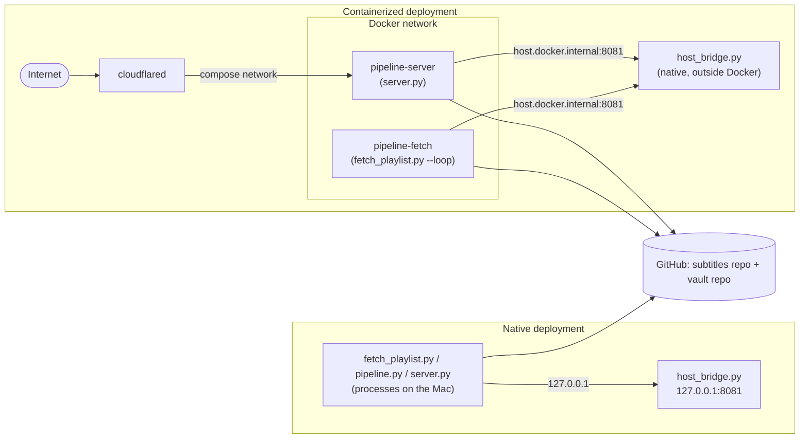
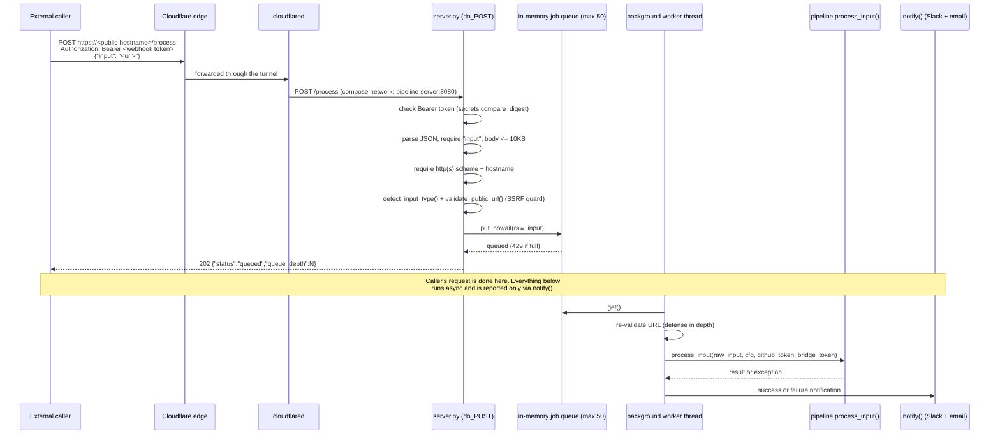
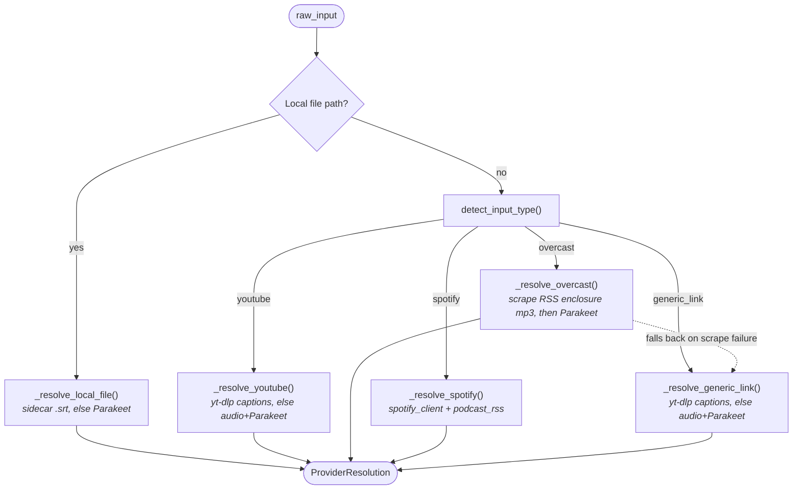
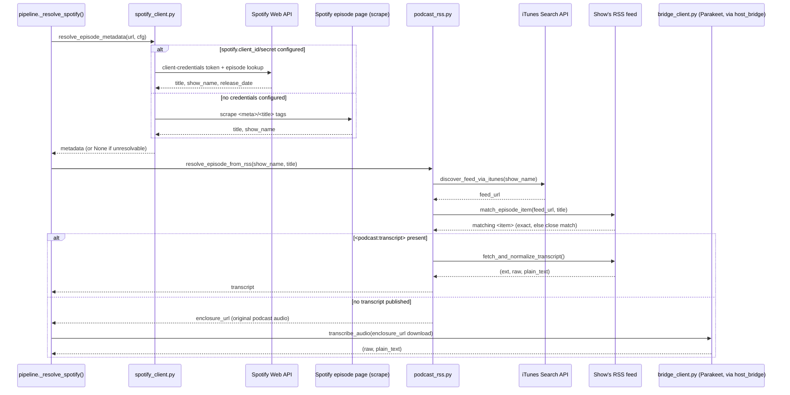
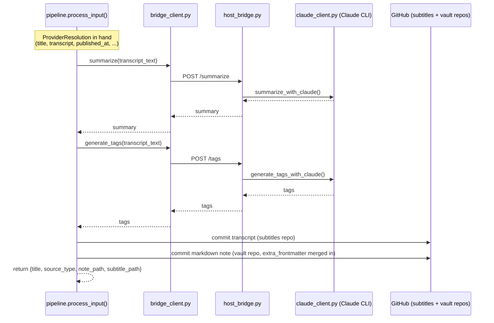
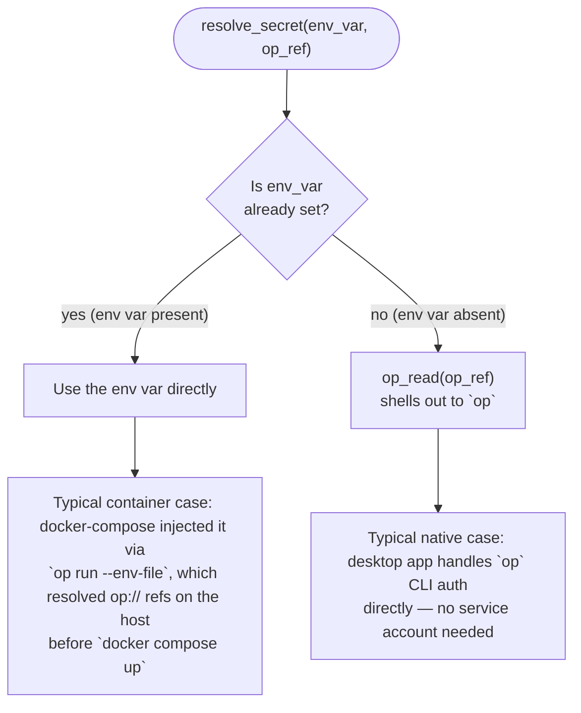

# Architecture

High-level, diagram-first view of how the pipeline is put together. For full detail on
config keys, secrets, scheduling, and per-file behavior, see [`CLAUDE.md`](../CLAUDE.md).

## 1. Components

The system splits along one hard constraint: `host_bridge.py` and the two modules it
wraps need to run natively on an Apple Silicon Mac (MLX for transcription, a
keychain-bound Claude CLI session for summarization). Everything else is plain
Python with no host dependency, which is what lets it run in a Linux container.

```mermaid
flowchart TB
    subgraph portable["Portable (native or container) - all under src/"]
        fetch["fetch_playlist.py<br/><i>polls YouTube playlist</i>"]
        server["server.py<br/><i>webhook: POST /process</i>"]
        pipeline["pipeline.py<br/><i>process_input() + provider resolvers</i>"]
        spotify["spotify_client.py<br/><i>Spotify episode metadata</i>"]
        podcastrss["podcast_rss.py<br/><i>RSS/Podcasting-2.0 transcript discovery</i>"]
        bridgeclient["bridge_client.py<br/><i>HTTP client</i>"]
        core["core.py<br/><i>config, state, git, notify, SSRF-safe fetch</i>"]
    end

    subgraph hostonly["Host-only (native Mac, never containerized)"]
        bridge["host_bridge.py<br/><i>HTTP server on 127.0.0.1</i>"]
        claude["claude_client.py<br/><i>summarize + tag via Claude CLI</i>"]
        transcribe["transcribe_backend.py<br/><i>Parakeet/MLX</i>"]
    end

    auth["youtube_auth.py<br/><i>one-time OAuth setup</i>"]

    fetch --> pipeline
    server --> pipeline
    fetch --> core
    server --> core
    pipeline --> core
    pipeline --> spotify
    pipeline --> podcastrss
    spotify --> core
    podcastrss --> core
    pipeline --> bridgeclient
    bridgeclient -- "HTTP, auth-token-gated" --> bridge
    bridge --> claude
    bridge --> transcribe
    bridge --> core
    claude -. "claude -p (sandboxed)" .-> claudeCLI(["Claude CLI"])
    transcribe -. "MLX" .-> parakeet(["Parakeet model"])

    style hostonly fill:#2d1b1b,stroke:#a33
    style portable fill:#1b2d1e,stroke:#3a3
```

**Why this shape:** `pipeline.py` never talks to MLX or the Claude CLI directly — it
calls `bridge_client.py`, which calls `host_bridge.py` over HTTP. That indirection is
the entire reason `pipeline.py`/`fetch_playlist.py`/`server.py` can run in a container
while transcription and summarization still happen on the Mac. `spotify_client.py` and
`podcast_rss.py` are pure metadata/HTTP adapters (no MLX/Claude dependency either) —
they only ever hand `pipeline.py` a transcript or an audio URL to feed into the same
`bridge_client` path every other source uses. `core.py`'s `open_pinned()`/`safe_fetch()`
are the shared SSRF-safe primitives both adapters (and `pipeline.py` itself) build on.

## 2. Deployment topology: native vs. containerized

Same `config.yaml`, two ways to run it. Only `bridge.url` differs between them.

**Notes:**
- `host_bridge.py` is never containerized in either mode — it must already be running
  before `pipeline.py`/`fetch_playlist.py`/`server.py` will succeed.
- In containerized mode, the two repo clone directories are bind-mounted at the *same
  absolute host paths* named in `config.yaml`, so both deployment modes see identical
  git state.
- `cloudflared`'s Public Hostname points at the compose service name
  (`pipeline-server:8080`), not `host.docker.internal` — that hostname only means
  something for the container → host-bridge hop.

## 3. External API access via Cloudflare Tunnel

`server.py`'s `POST /process` is the only way something outside this Mac triggers the
pipeline. The request is validated and enqueued synchronously, but the actual work
(download/transcribe/summarize/commit) happens later on a background thread — the
caller's `202` response arrives long before the job is done, and there's no polling
endpoint. The caller finds out what happened via `notify()` (Slack/email), not via
the HTTP response.

**Why the split matters:**
- The HTTP handler never does slow work itself — it only validates and enqueues —
  because tunnel/edge requests typically time out long before a
  download-transcribe-summarize-commit cycle finishes.
- A single background thread drains the queue one job at a time, same as the native
  case: `process_input()` shares `host_bridge.py`'s cached Parakeet model and the
  on-disk git clones across calls, so concurrent processing isn't safe.
- The webhook auth token (`webhook.auth_token_op_ref`) is a distinct secret from the
  bridge auth token (`bridge.auth_token_op_ref`) — a public internet caller and the
  Docker-network-only `pipeline.py` → `host_bridge.py` hop are different trust
  boundaries and never share a credential.
- Only `http(s)` URLs are accepted here (unlike the CLI's `--input`, which also
  accepts local file paths) — a network caller has no business asking this Mac to
  read an arbitrary local file, and `validate_public_url()` additionally rejects
  private/loopback IPs to block SSRF via redirects or DNS rebinding.

## 4. Resolving one input to a transcript

Whether it's `fetch_playlist.py` finding a new playlist video, `server.py` receiving a
webhook, or a manual `pipeline.py --input`, everything funnels into
`process_input()`, which picks exactly one `_resolve_*` function based on
`source_type` and gets back a normalized `ProviderResolution` (title, transcript
body/text, published-at, optional extra frontmatter). Adding a future source means
writing one new `_resolve_*` function and one dispatch line — `process_input()`
itself has no source-specific branching beyond the dispatch.

**Notes:**
- `detect_input_type()` only classifies HTTP(S) URLs (`youtube` / `overcast` /
  `spotify` / `generic_link`); the local-file check happens first, directly in
  `process_input()`, before any URL parsing.
- Only Spotify *episode* URLs get the `spotify` treatment — show pages and track
  URLs fall through to `generic_link`, where yt-dlp (which doesn't support Spotify)
  simply fails to find anything, a clear enough "unsupported" outcome without extra
  special-casing.
- If `raw_srt_body`/`transcript_text` both come back empty from any resolver,
  `process_input()` raises `NoTranscriptAvailableError` uniformly, regardless of
  which source it was.

## 5. Spotify episode resolution: metadata → RSS → transcript or audio

The most convoluted resolver, because Spotify's Web API prohibits downloading
Spotify-streamed audio and exposes neither transcripts nor a show's RSS feed URL.
`_resolve_spotify()` never touches Spotify's private web-player transcript endpoint
or Spotify-hosted audio — it only ever uses Spotify to learn a title and show name,
then finds the real content via the podcast's own public RSS feed.

If metadata resolution, feed discovery, or episode matching fails at any step, the
resolver returns a `ProviderResolution` with no transcript rather than raising —
`process_input()`'s usual `NoTranscriptAvailableError` check catches it exactly like
any other source that comes up empty.

## 6. From transcript to published note

Once any resolver above returns a `ProviderResolution` with a transcript,
`process_input()` continues identically regardless of source:

`extra_frontmatter` (e.g. Spotify's resolved `podcast_feed_url`) is the one field a
`ProviderResolution` can carry that's provider-specific — `build_note()` merges it in
without `process_input()` needing to know which source produced it.

## 7. Secrets resolution: native vs. container

Runtime service secrets (GitHub token, bridge/webhook auth tokens) go through the
same function, which picks its source based on where it's running rather than
branching per-deployment code.

**Why one function, not two code paths:** natively, `op` is authenticated via the
1Password desktop app, so `op_read()` just works. In a container there's no `op`
binary at all, so the same env vars are pre-resolved on the host and passed straight
through — `resolve_secret()` never needs to know which mode it's in.

**Exception:** Google OAuth client id/secret (for YouTube API access) are handled
outside this flow. `youtube_auth.py` is a one-time setup script that reads those
values directly with its own `op_read()` call, so the pre-populated environment
variable mechanism documented above does not apply to that initial OAuth handshake.
